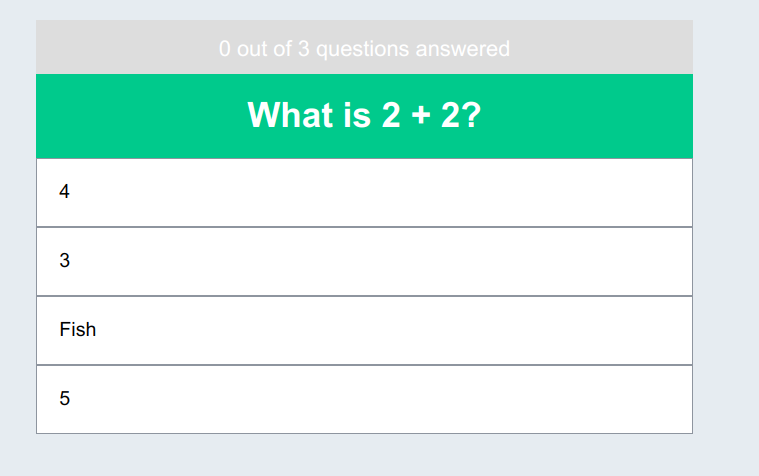
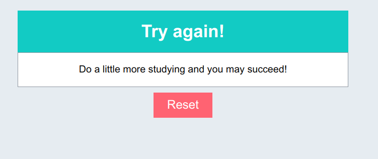

# 1. quiz

This template should help get you started developing with Vue 3 in Vite.

## 1.1. Recommended IDE Setup

[VSCode](https://code.visualstudio.com/) + [Volar](https://marketplace.visualstudio.com/items?itemName=Vue.volar) (and disable Vetur) + [TypeScript Vue Plugin (Volar)](https://marketplace.visualstudio.com/items?itemName=Vue.vscode-typescript-vue-plugin).

## 1.2. Customize configuration

See [Vite Configuration Reference](https://vitejs.dev/config/).

## 1.3. Project Setup

```sh
npm install
```

### 1.3.1. Compile and Hot-Reload for Development

```sh
npm run dev
```

### 1.3.2. Compile and Minify for Production

```sh
npm run build
```

### 1.3.3. Demo 

* Question 1


* Question 2


* Result 1


* Result 2


